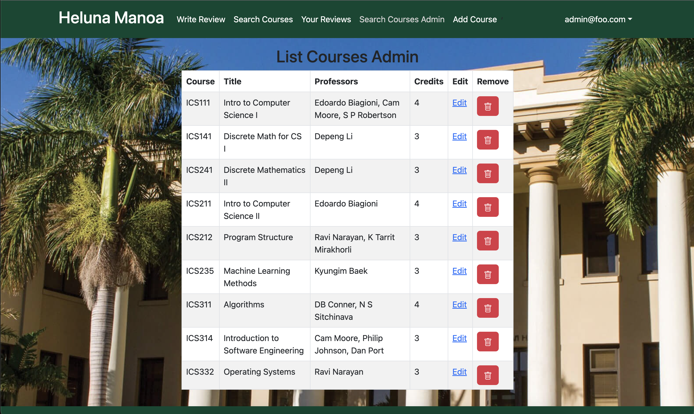

# Welcome to Heluna Manoa

### The custom-built course rating website meant to help make schedule building easier.

Ever had to make a difficult choice between two courses (or professors) with no access to any helpful information? Maybe the professor is a graduate student, or maybe they have close to no teaching experience at Manoa, so RateMyProfessor doesn't display them.

This is where HelunaManoa can help. With our Warrior-sourced reviews and simple interface, you will be able to gain easy access to information that cannot be found on national websites.

## Team Members
- [Carson Fu](https://github.com/CarsonFu)
- [Kurt Kimura](https://github.com/KurtKimura02)
- [Cade Kane](https://github.com/cadekane)
- [Zeb Lakey](https://github.com/zeb1283)
- [Ryan Seng](https://github.com/ryanseng32)

## Github Organization
We came together at Team Five Guys to create a website that we all believed in. Our repositories are housed within this [Github Organization.](https://github.com/heluna-manoa) You'll find our website in heluna-manoa and this website as heluna-manoa.github.io.

## Team Contract
This is our [Team Contract](https://docs.google.com/document/d/12twXzM_kbYR9SQWyv-C6Nzfe04kZUe1oB3TTHs8LCSo/edit). We did not consult a lawyer.

## M1 Project Page
This is the [M1 Project page](https://github.com/orgs/heluna-manoa/projects/1). Here you'll find all of what we worked on in the first week. Overall, we mainly focused on the backend of the site and made sure everything was properly communicating.

## M2 Project Page
This is the [M2 Project page](https://github.com/orgs/heluna-manoa/projects/2). We are looking to get the UI improved (no more black text over dark images). Additionally, we will be adding new pages for administrators and creating a better way to submit forms.

## Deployment
Here is our website: [https://helunamanoa.info](https://helunamanoa.info)

When writing a review, you need to interact with the anonymous checkbox to submit it. It's a bug that'll be fixed by next milestone. Most everything else should be fully functional.

## Landing Page (Unlogged)

As of now, Heluna Manoa has a forest green theme that matches the colors of its affiliated university: the University of Hawaii at Manoa. The background picture is also somewhat of a placeholder and is subject to change in the following iterations of our project. The search bars are mock-ups that will be able to search by course and professor.

## Landing Page (With Search/Logged In)

Once the user logs in, they are taken to the actual landing page, which now has an update navigation bar with several options.

## List/Search Courses Page

This page shows a listing of all courses in the form of a table. The user is able to click on specific courses which lead to their own pages.

## Specific Course Page

This page is a page whose content changes based on the specific course link that was clicked on. It displays the information for that course on its own page rather than in a table with other courses like the list courses page.

## Write Review Page

This page allows the user to write a review by entering the course title, the code of the course, the instructor's name, the course/instructor rating, and any comments about the course/instructor.

## Your Reviews Page

This page shows all of the current user's historical reviews. Each field will display the review along with buttons to edit or delete the review.

## Admin List Courses Page

In the case of there being a change in the details of a course listing, admins have the ability to go in and alter or delete course listings in an effort to update the list.

## Admin Add Course Page

This page allows admin to update course listings by adding a new course to the course collection.
