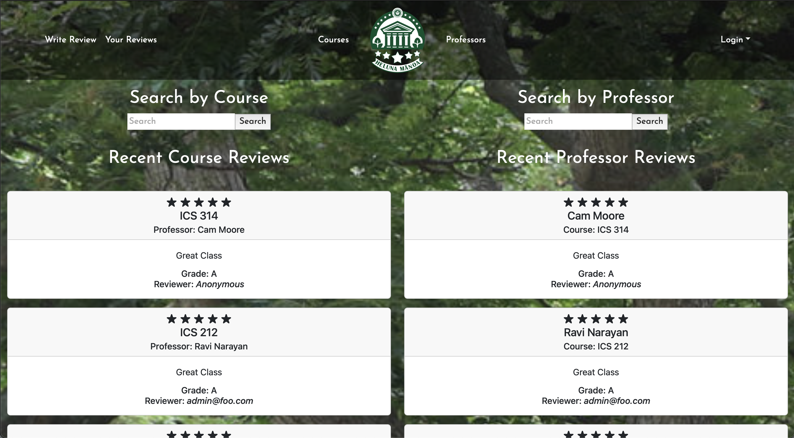
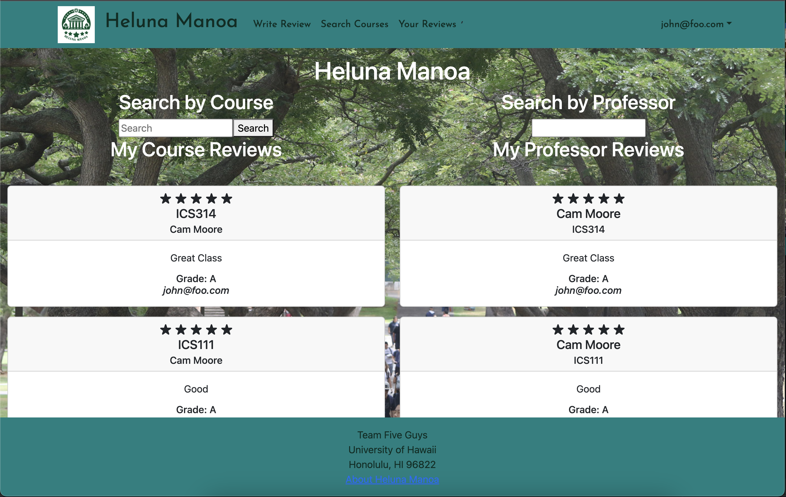
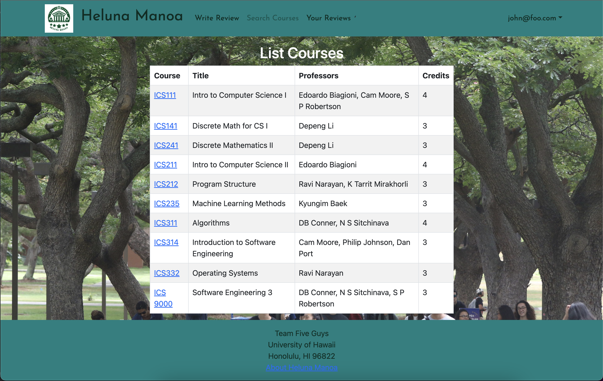
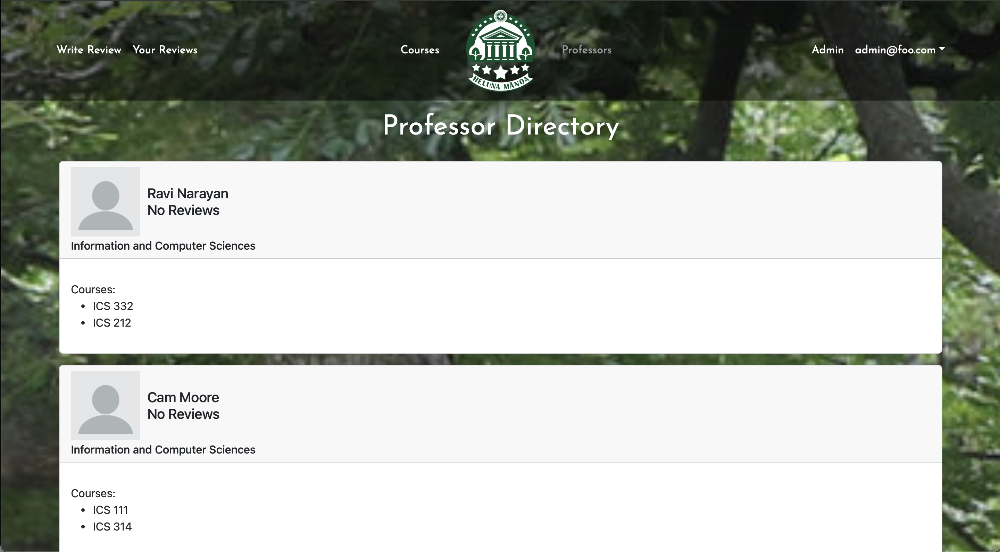
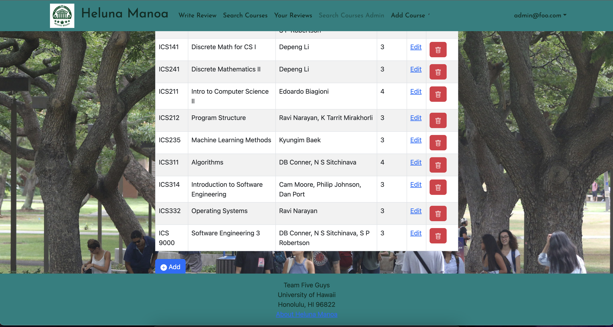
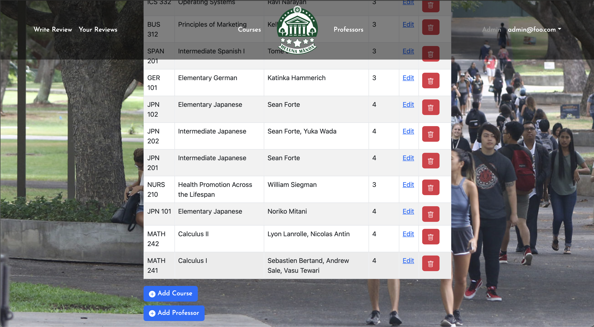
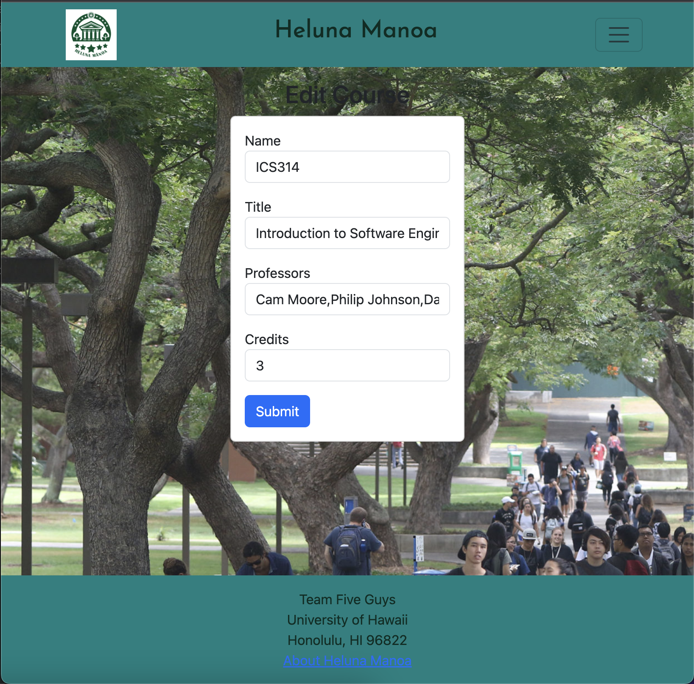

# Welcome to Heluna Manoa

### The custom-built course rating website meant to help make schedule building easier.

Ever had to make a difficult choice between two courses (or professors) with no access to any helpful information? Maybe the professor is a graduate student, or maybe they have close to no teaching experience at Mānoa, so RateMyProfessor doesn't display them.

This is where HelunaManoa can help. With our Warrior-sourced reviews and simple interface, you will be able to gain easy access to information that cannot be found on national websites.

## Team Members
- [Carson Fu](https://github.com/CarsonFu)
- [Kurt Kimura](https://github.com/KurtKimura02)
- [Cade Kane](https://github.com/cadekane)
- [Zeb Lakey](https://github.com/zeb1283)
- [Ryan Seng](https://github.com/ryanseng32)

## Github Organization
We came together at Team Five Guys to create a website that we all believed in. Our repositories are housed within this [Github Organization.](https://github.com/heluna-manoa) You'll find our website in heluna-manoa and this website as heluna-manoa.github.io.

## Team Contract
This is our [Team Contract](https://docs.google.com/document/d/12twXzM_kbYR9SQWyv-C6Nzfe04kZUe1oB3TTHs8LCSo/edit). We did not consult a lawyer.

## M1 Project Page
This is the [M1 Project page](https://github.com/orgs/heluna-manoa/projects/1). Here you'll find all of what we worked on in the first week. Overall, we mainly focused on the backend of the site and made sure everything was properly communicating.

## M2 Project Page
This is the [M2 Project page](https://github.com/orgs/heluna-manoa/projects/2). We are looking to get the UI improved (no more black text over dark images). Additionally, we will be adding new pages for administrators and creating a better way to submit forms.

## M3 Project Page
This is the [M3 Project page](https://github.com/orgs/heluna-manoa/projects/3).
We are looking to deploy several improvements to the functionality and look of the project. 

## Deployment
Here is our website: [https://helunamanoa.info](https://helunamanoa.info)

# User Guide

## Landing Page (Unlogged)
### V1:

### V2:

### V3:

#### V3 UPDATE:
Version 3 adds reviews that were recently submitted by users to the home landing page when the user is not logged in. The navbar is now a lot cleaner and opaque. The default footer has now been removed to give more space for the content.

#### V2 LEGACY:
Version 2 of the un-logged landing page has all the same features as the first, but with readable font colors and a revamped look. The search bars will work once the reviews properly display when not logged in.

#### V1 LEGACY:
As of now, Heluna Manoa has a forest green theme that matches the colors of its affiliated university: the University of Hawaii at Manoa. The background picture is also somewhat of a placeholder and is subject to change in the following iterations of our project. The search bars are mock-ups that will be able to search by course and professor.

## Landing Page (With Search/Logged In)
### V1:

### V2

### V3:

#### V3 UPDATE:
Now that the user has logged in, they are able to see their recent reviews and professors.

#### V2 LEGACY:
The logged in landing is much improved, with your reviews being displayed under the search bar (which is fully functional). 

#### V1 LEGACY:
Once the user logs in, they are taken to the actual landing page, which now has an update navigation bar with several options.

## List/Search Courses Page
### V1:

### V2:

### V3:

#### V3 UPDATE:
The list courses page has remained unchanged, just some minor bug fixes and adding an average rating column.

#### V2 LEGACY:
This remains largely the same, other than the website-wide style updates.

#### V1 LEGACY:
This page shows a listing of all courses in the form of a table. The user is able to click on specific courses which lead to their own pages.

## *NEW* List Professors

### V3

#### V3 UPDATE
You may now view all the professors, along with the classes they teach.

## Specific Course Page

### V1:

### V2:

### V3:

#### V3 UPDATE:
Clicking a course page now looks much cleaner with white text and the removal of the edit and delete buttons. 

#### V2 UPDATE:
Still need to work on the CSS a little bit, but reviews now display on the specific course page. This is what the search bar will display when a query is sent and is what comes up when a course is clicked on.

#### V1 LEGACY:
This page is a page whose content changes based on the specific course link that was clicked on. It displays the information for that course on its own page rather than in a table with other courses like the list courses page.

## Write Review Page

### V1:

### V2:

### V3:

#### V3 UPDATE:
Write Review has not changed much at all. Only the styling and font has changed which reflects all other pages.

#### V2 LEGACY:
Nothing much here. CSS updates and the anonymous field now works properly.

#### V1 LEGACY:
This page allows the user to write a review by entering the course title, the code of the course, the instructor's name, the course/instructor rating, and any comments about the course/instructor.

## Your Reviews Page

### V1:

### V2:

### V3:

#### V3 UPDATE:
The personal review cards has not changed much, however it now displays if you checked the box to remain anonymous when submitting your review. Deleting your review now pushes a warning, asking for confirmation of deletion.

#### V2 UPDATE:
The review cards (as seen on other website areas) now have edit and delete fields. The most important update of the project thus far was also pushed (the rating now displays a certain number of stars).

#### V1 LEGACY:
This page shows all the current user's historical reviews. Each field will display the review along with buttons to edit or delete the review.

## Edit Review Page

### V2:

### V3:

#### V3 UPDATE:
This page has not changed much at all however, once submitting an edit, it now brings you back to your user review page.

#### V2 LEGACY:
This is what the edit button on the previous page leads to. It allows the user to edit the review and updates the database.

## Admin List Courses Page

### V1:

### V2:

### V3:

#### V3 UPDATE:
The admin pages have been consolidated into just one admin panel where they can edit, add course, and add professor, along with removing courses.

#### V2 LEGACY:
There is now an add course button. Probably going to remove the add course from the navbar.

#### V1 LEGACY:
In the case of there being a change in the details of a course listing, admins have the ability to go in and alter or delete course listings in an effort to update the list.

## Edit Course Page

### V2

### V3:

#### V3 UPDATE:
The admin edit course page has remained the same.

#### V2 LEGACY
Allows the admin to edit the course.

## Admin Add Course Page

### V1:

### V2:

### V3:

#### V3 UPDATE:
Admin Add Course has remained the same.

#### V2 LEGACY:
Now is fully functional and adds to one collection/updates another.

#### V1 LEGACY:
This page allows admin to update course listings by adding a new course to the course collection.

# Developer Guide

The first step to developing here is to download [Meteor](https://docs.meteor.com/install.html).

Clone the project to your local machine via GitHub Desktop. Open a terminal window, cd to /heluna-manoa/app, and run the scripts meteor npm install and meteor npm run start.

The website utilizes 3 MongoDB collections, called Courses, Professors, and Reviews. Each of these are housed within the imports/api directory. Every collection is modified by different types of input forms, that being Write a Review, Add a Course, Add a Professor, and Edit a Course.

Website components are housed under imports/ui/components, and include the navbar and search bars for courses and professors. Website pages are housed under imports/ui/pages.

# Community Feedback

We had 5 community members test out Heluna Mānoa.

The feedback for the website encompasses various suggestions and positive comments:

1. **Enlarged Text Box:** Users want a bigger text box for reviews to ensure visibility while typing.

2. **Account Creation Error:** There's an issue with an error message when initially creating an account; the page appears to not exist.

3. **Course Categorization:** Suggested improvements include organizing courses alphabetically and by field of study for easier navigation and finding relevant majors.

4. **Font Size at the Top:** Feedback mentions that the font at the top of the website needs to be larger due to excessive empty space.

5. **Star Rating System:** Users want a more detailed star rating system, possibly with the inclusion of half stars.

6. **Review Submission:** Upon submitting a review, users want the page to stay on the same page rather than navigating elsewhere.

7. **Clarity and Functionality:** Overall, the site works well and is clear, with no specific issues noted by the reviewers.

8. **Rating Distribution:** The website received ratings of 5, 4, 3, 4, and 4 from different users.

To improve the website, we would consider implementing the following: enlarging the text box for reviews, resolving the account creation error, reorganizing course listings, adjusting font size at the top, enhancing the star rating system, optimizing the review submission process, and possibly adding an FAQ or clearer instructions for users. The website has received overall positive reviews.