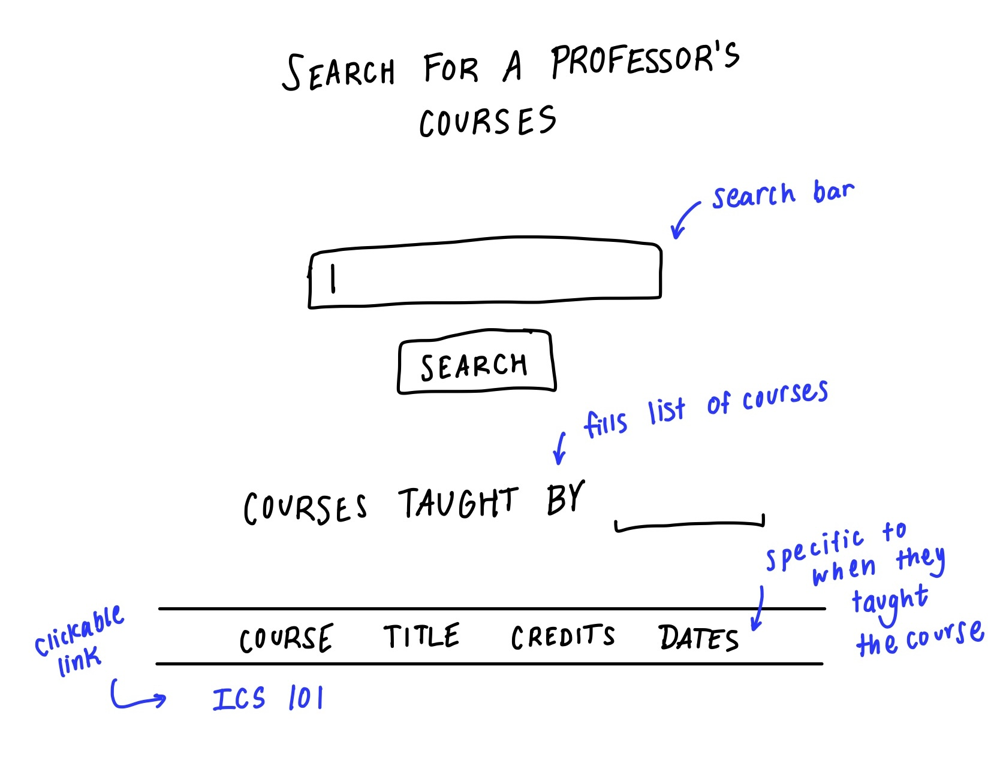
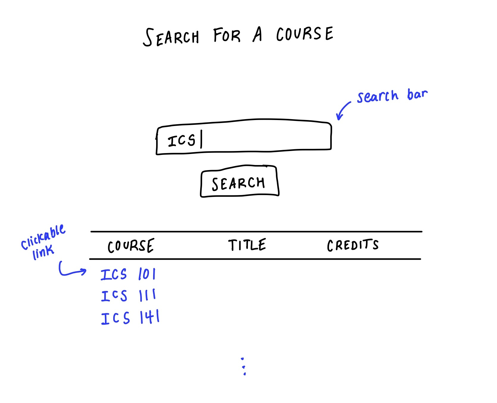
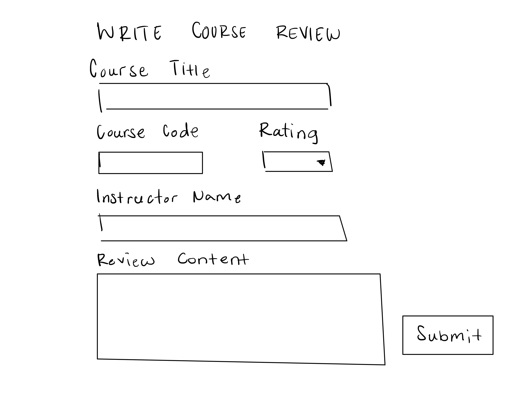
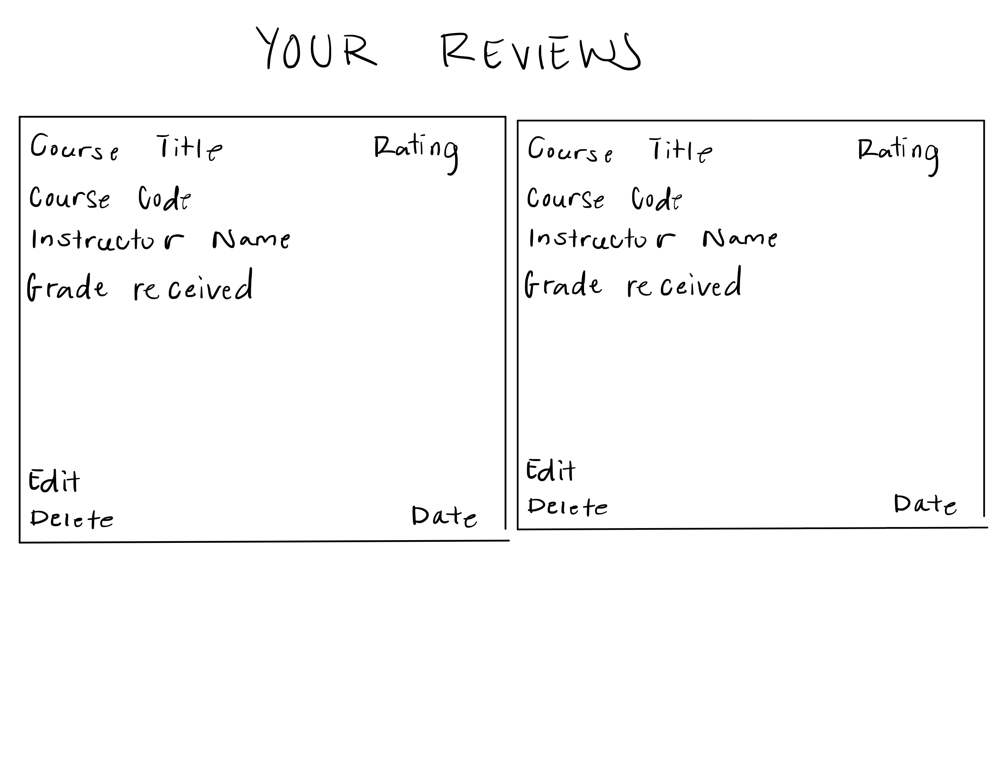
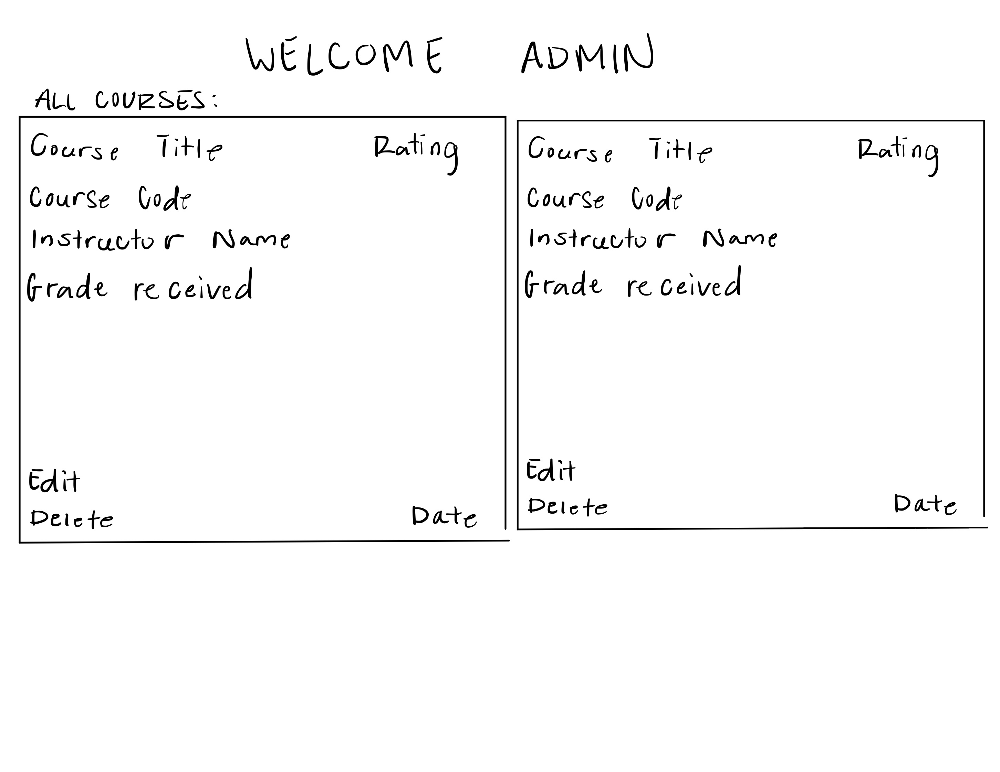

# Welcome to Heluna Manoa

### The custom-built course rating website meant to help make schedule building easier.

Ever had to make a difficult choice between two courses (or professors) with no access to any helpful information? Maybe the professor is a graduate student, or maybe they have close to no teaching experience at Manoa, so RateMyProfessor doesn't display them.

This is where HelunaManoa can help. With our Warrior-sourced reviews and simple interface, you will be able to gain easy access to information that cannot be found on national websites.
## Team Members
- Carson Fu
- Kurt Kimura
- Cade Kane
- Zeb Lakey
- Ryan Seng
## Links
- [Github Organization](https://github.com/heluna-manoa)
- [Team Contract](https://docs.google.com/document/d/12twXzM_kbYR9SQWyv-C6Nzfe04kZUe1oB3TTHs8LCSo/edit)
- [M1 Project page](https://github.com/orgs/heluna-manoa/projects/1)
- [Project Presentation](https://docs.google.com/presentation/d/1cNOeQgEP03B-rQ20OXL9z2knQaNhdSBpdU4lwtChcpQ/edit#slide=id.g298e20f8316_1_18)

## Search Professors Page

## Search Courses Page

## Write Review Page

This page allows the user to write a review by entering the course title, the code of the course, the instructor's name, the course/instructor rating, and any comments about the course/instructor.

## User Reviews Page

This page shows all of the current user's historical reviews. Each field will display the review along with buttons to edit or delete the review.

## Admin Page

In the case of abusive behavior and trolling, admins have the power to monitor and act on certain review by editing or deleting the entry.

