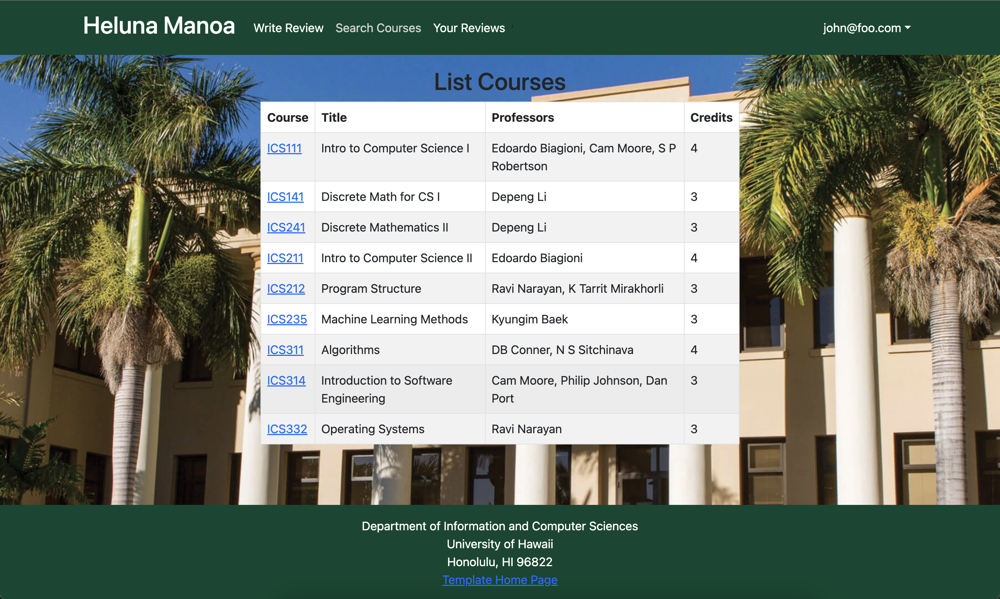

# Welcome to Heluna Manoa

### The custom-built course rating website meant to help make schedule building easier.

Ever had to make a difficult choice between two courses (or professors) with no access to any helpful information? Maybe the professor is a graduate student, or maybe they have close to no teaching experience at Manoa, so RateMyProfessor doesn't display them.

This is where HelunaManoa can help. With our Warrior-sourced reviews and simple interface, you will be able to gain easy access to information that cannot be found on national websites.

## Team Members
- [Carson Fu](https://github.com/CarsonFu)
- [Kurt Kimura](https://github.com/KurtKimura02)
- [Cade Kane](https://github.com/cadekane)
- [Zeb Lakey](https://github.com/zeb1283)
- [Ryan Seng](https://github.com/ryanseng32)

## Github Organization
We came together at Team Five Guys to create a website that we all believed in. Our repositories are housed within this [Github Organization.](https://github.com/heluna-manoa) You'll find our website in heluna-manoa and this website as heluna-manoa.github.io.

## Team Contract
This is our [Team Contract](https://docs.google.com/document/d/12twXzM_kbYR9SQWyv-C6Nzfe04kZUe1oB3TTHs8LCSo/edit). We did not consult a lawyer.

## M1 Project Page
This is the [M1 Project page](https://github.com/orgs/heluna-manoa/projects/1). Here you'll find all of what we worked on in the first week. Overall, we mainly focused on the backend of the site and made sure everything was properly communicating.

## M2 Project Page
This is the [M2 Project page](https://github.com/orgs/heluna-manoa/projects/2). We are looking to get the UI improved (no more black text over dark images). Additionally, we will be adding new pages for administrators and creating a better way to submit forms.

## M3 Project Page
This is the [M3 Project page](https://github.com/orgs/heluna-manoa/projects/3).
We are looking to deploy several improvements to the functionality and look of the project. 

## Deployment
Here is our website: [https://helunamanoa.info](https://helunamanoa.info)

# User Guide

## Landing Page (Unlogged)
### V1:

### V2:

#### V2 UPDATE:
Version 2 of the un-logged landing page has all the same features as the first, but with readable font colors and a revamped look. The search bars will work once the reviews properly display when not logged in.

#### V1 LEGACY:
As of now, Heluna Manoa has a forest green theme that matches the colors of its affiliated university: the University of Hawaii at Manoa. The background picture is also somewhat of a placeholder and is subject to change in the following iterations of our project. The search bars are mock-ups that will be able to search by course and professor.

## Landing Page (With Search/Logged In)
### V1:

### V2

#### V2 UPDATE:
The logged in landing is much improved, with your reviews being displayed under the search bar (which is fully functional). 

#### V1 LEGACY:
Once the user logs in, they are taken to the actual landing page, which now has an update navigation bar with several options.

## List/Search Courses Page
### V1:

### V2:

#### V2 UPDATE:
This remains largely the same, other than the website-wide style updates.

#### V1 LEGACY:
This page shows a listing of all courses in the form of a table. The user is able to click on specific courses which lead to their own pages.

## Specific Course Page

### V1:

### V2:

#### V2 UPDATE:
Still need to work on the CSS a little bit, but reviews now display on the specific course page. This is what the search bar will display when a query is sent and is what comes up when a course is clicked on.

#### V1 LEGACY:
This page is a page whose content changes based on the specific course link that was clicked on. It displays the information for that course on its own page rather than in a table with other courses like the list courses page.

## Write Review Page

### V1:

### V2:

#### V2 UPDATE:
Nothing much here. CSS updates and the anonymous field now works properly.

#### V1 LEGACY:
This page allows the user to write a review by entering the course title, the code of the course, the instructor's name, the course/instructor rating, and any comments about the course/instructor.

## Your Reviews Page

### V1:

### V2:

#### V2 UPDATE:
The review cards (as seen on other website areas) now have edit and delete fields. The most important update of the project thus far was also pushed (the rating now displays a certain number of stars).

#### V1 LEGACY:
This page shows all the current user's historical reviews. Each field will display the review along with buttons to edit or delete the review.

## *NEW:* Edit Review Page

This is what the edit button on the previous page leads to. It allows the user to edit the review and updates the database.

## Admin List Courses Page

### V1:

### V2:

#### V2 UPDATE:
There is now an add course button. Probably going to remove the add course from the navbar.

#### V1 LEGACY:
In the case of there being a change in the details of a course listing, admins have the ability to go in and alter or delete course listings in an effort to update the list.

## *NOT NEW BUT DIDN'T INCLUDE LAST TIME:* Edit Course Page

Allows the admin to edit the course.

## Admin Add Course Page

### V1:

### V2:

#### V2 UPDATE:
Now is fully functional and adds to one collection/updates another.

#### V1 LEGACY:
This page allows admin to update course listings by adding a new course to the course collection.

# Developer Guide

The first step to developing here is to download [Meteor](https://docs.meteor.com/install.html).

Clone the project to your local machine via GitHub Desktop. Open a terminal window, cd to /heluna-manoa/app, and run the script 
    meteor npm run start.